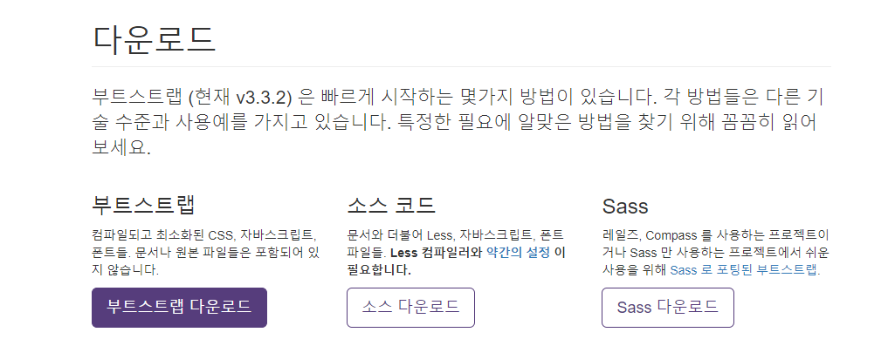

# 부트스트랩 시작하기

## 부트스트랩?
    누구나 쉽게 웹사이트를 만들 수 있게 해주는 프레임워크.  

- 반응형 웹사이트를 만들때 사용하는 HTML, CSS를 그대로 가져다 문서를 만들 수 있다.
- 공식홈페이지 : www.getbootstrap.com   

## 부트스트랩 다운로드 방법
    다운로드 방법에는 직접 다운로드해서 링크하는 방법과, CDN을 이용해 링크해서 사용하는 방법이 있다.

- 직접 다운로드 : 인터넷이 연결되지 않아도 사용 가능.
- CDN : Content Delivery Network의 줄임말로 인터넷이 연결되 있어야함.

### 직접다운로드
  

0. http://bootstrapk.com/getting-started/ 이 경로에서 파일을 다운.
1. 다운로드 후 파일의 압축을 푼다.
2. 부트스트랩 버전이 표시된 폴더안에 있는 css와 js,font폴더를 확인한다.

### CDN으로 링크


0. http://bootstrapk.com/getting-started/ 이 경로에서 CDN문서를 찾음.
1. CDN설명 부분에서 [Copy]를 클릭해 복사해서 HTML의 `<head>...</head>`태그에 붙여 넣음.

## 부트스트랩 사용 방법
    1. 웹 문서들을 저장할 폴더를 만든 후 그 폴더에 부트스트랩의 css폴더와 js폴더, font폴더를 복사한다.  
    
    2. https://github.com/aFarkas/html5shiv 페이지에서 목록 위에 있는 [Clone or download -> Download ZIP]를 클릭

    3. 다운 후 압축을 풀고, [src -> html5shiv.js] 파일이나, [dest -> html5shiv.min.js]파일을 원하는 폴더로 복사해 사용.

    4. 다운한 js파일은 아래 방법처럼 링크해서 사용한다.
    
```js
    <!--[if it IE 9]>
        <script src="js/html5shiv.min.js"></script>
        <script src="respond/respond.min.js"></script>
    <![endif]-->    
```

    5. Github에서 다운한 html5shiv.js파일과 respond.js파일도 복사한다.
    
    6. 그리고 images 폴더를 만들어 앞으로 만들 웹 문서에 사용할 이미지들까지 가져다 놓으면 모든 준비가 끝난다.

---
지금까지 다운로드한 js파일과 css파일을 가지고 부트스트랩을 사용하기 위한 가장 기본적인 문서 틀을 만들면 다음과 같다.

```html
    <!DIOCTYPE html>
    <html lang="ko">
    <head>
        <meta charset="utf-8">
        <meta name="viewport" content="width=device-width, initial-scale=1"> <!-- 뷰 포트 설정 -->
        <title>부트스트랩 기본 템플릿</title>

        <link href="css/bootstrap.min.css" rel="stylesheet"> <!-- 부트스트랩css파일 -->

    <!--[if it IE 9]>
        <script src="html5shiv/html5shiv.min.js"></script>
        <script src="respond/respond.min.js"></script>
    <![endif]-->
    </head>
    <body>
        <h1>Hello, World!</h1>  
        ~ 이하 웹 문서 내용 ~

        <script src="js/jquery-2.1.3.min.js"></script>
        <!-- jQuery 라이브러리 연결 ,CDN으로도 연결 가능 -->
        <script src="js/bootstrap.min.js"></script>
        <!-- 부트스트랩 js파일 연결 -->
    </body>
    </html>
```

