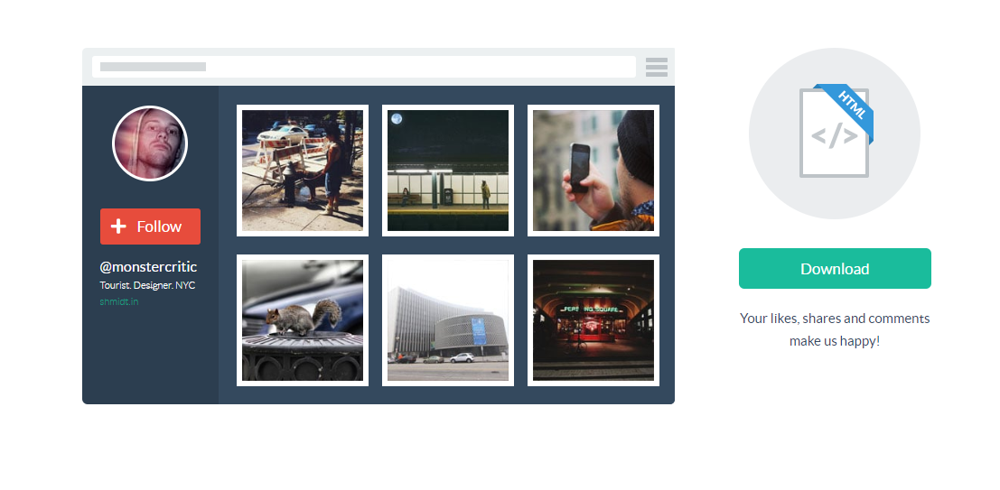
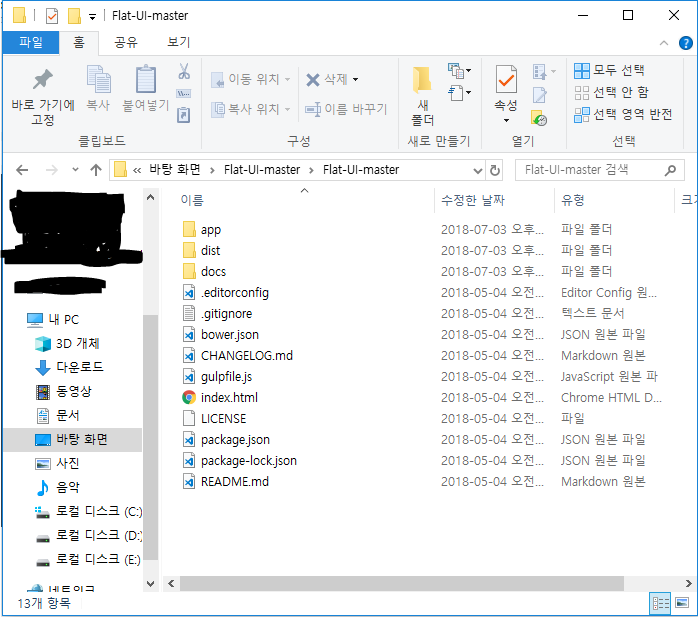
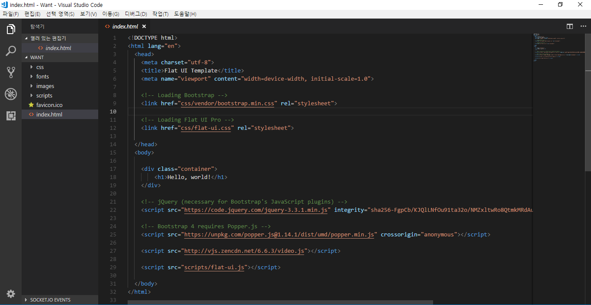
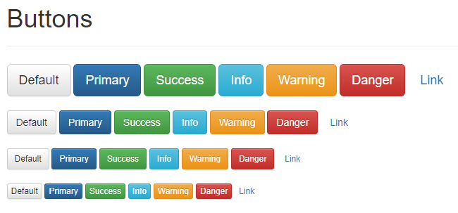
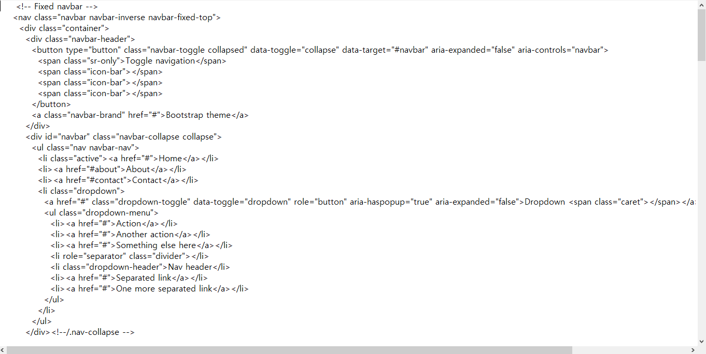

# 플랫 디자인
검색 엔진에 'flat ui kit'으로 검색하면 유/무료 키트들이 많이 검색된다. 플랫 UI키트는 이름부터 결과물까지 크게 다르지않고 공개된 키트도 많다.

    예시
        Flat UI : http://designmodo.github.io/Flat-UI/
        Stark Web : http://www.baianat.com/resources/stark/
        Featherweight UI : https://goo.gl/o6O9PM

## 프레임워크 파일 다운
1. http://designmodo.github.io/Flat-UI 로 접속 후 필요한 파일 다운.

2. 압축을 푼 후 dist폴더 안에 있는 파일을 모두 복사해서 사이트 제작에 필요한 폴더로 복사한다.

3. 템플릿 문서를 수정한다.

index.html파일을 열어서 `<body>...</body>`사이에 원하는 소스만 입력하면 된다.  
    
         + 소스의 2번째 줄에 있는 <html lang="en">을 <html>로 수정하고, 인코딩을 utf-8로 수정.

4. 부트스트랩 예제 페이지에 Flat UI스타일을 적용한다.  

http://getbootstrap.com/examples/theme/ 페이지에 가면 부트스트랩의 기본 테마를 이용한 예제가 있다.  
이 예제의 버튼은 입체적인 그러데이션 효과가 적용되어 있는 것을 확인할 수 있다.  
이 페이지에 Flat UI의 CSS파일을 링크해서 플랫 디자인 형태로 바꿔보자.

5. 깃헙에 내가 올린 파일 중 bootstrap-doc.txt의 소스를 모두 복사한다. 이것은 부트스트랩에서 제공하는 기본 테마 파일 페이지에서 점보트론과 버튼, 내비게이션 바, 알림, 진행 막대 소스 이다.

6. index.html에 있던 `<h1>Hello, world!</h1>`을 삭제한 후, 그 자리에 방금 복사한 소스를 붙여넣는다.

7. 저장후 브라우저로 확인한다.